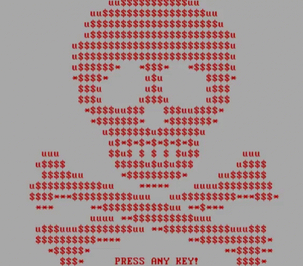

# Lockme
Un simple PoC de ransomware desarrollado en python3





## ¿Cómo funciona Lockme? 🚀


Lockme escanea los archivos en un directorio previamente definido (o en varios), y los encripta con Fernet, cuando termina de encriptar los archivos, encripta la clave Fernet con una clave pública de RSA-4096 y la envía a un servidor junto con el ID del víctima.

Después de este proceso, la víctima de Lockme obtendrá una GUI para descifrar sus archivos.


### Requisitos 📋


* Un par de claves RSA
* Un servidor web donde recibir las claves


### ¿Cómo se usa? 🔧


_Tienes que modificar las siguientes variables con tus opciones_
''
13. server
14. serverrsa
15. directories
''


### Usando Pyinstaller para obtener un exe 🛠️


Para evitar errores al usar pyinstaller, cambie la variable booleana `` `iamexe``` a True.


### Disclaimer ⚠️


** Como ya mencioné antes, esta herramienta es un PoC, no uso mal que se le puede dar **


### Autor ✒️

* **s4tak** - (https://github.com/s4tak)

